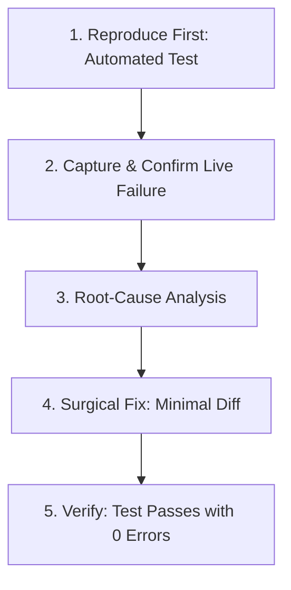

# Bug Reproduction Protocol (Reproduce-First Loop)

This skill governs the systematic investigation, reproduction, and surgical remediation of software bugs, console warnings, and regression failures across Medusa backend and Vue storefront.

---

## 1. The Core Philosophy

> [!CRITICAL]
> **No Guesswork, Zero Speculation**: Never modify application code until the failure has been observed live in an automated test. Never claim a bug is resolved based solely on static analysis, type checks, or assumptions.

---

## 2. The 5-Step Reproduction First Loop

### Step 1: Reproduce First
- Write or execute an automated test BEFORE modifying any application code.
- Tool selection:
  - **Browser runtime / console errors / visual regressions**: Use Playwright inside `playwright` container.
  - **Backend logic / database / workflows / Medusa modules**: Use Jest unit or integration suites in `workspace`.
  - **Storefront utility functions / Pinia stores / component state**: Use Vitest / Jest in `workspace`.

### Step 2: Capture & Confirm
- Run the test in the appropriate Docker container (`workspace` or `playwright`).
- Confirm that the exact error string, stack trace, or warning appears live in the test runner output.
- Record the baseline failure.

### Step 3: Root-Cause Analysis
- Trace the root cause rather than patching symptoms.
- Examples:
  - SVG bounding box shift $\rightarrow$ trigonometry calculation error on flap bevels.
  - 400 Bad Request on cart $\rightarrow$ invalid order spec payload schema or unhandled promise in workflow step.
  - Reactivity defect $\rightarrow$ direct mutation of Pinia store state without reactive unwrapping.

### Step 4: Surgical Fix
- Apply the minimal targeted diff (Ponytail discipline: fewest changed lines, zero unrequested refactoring).
- Touch only the lines directly causing the defect.

### Step 5: Verify with Test
- Re-run the reproducing test in the real Docker container environment.
- Confirm green exit code, zero errors, and zero warnings.
