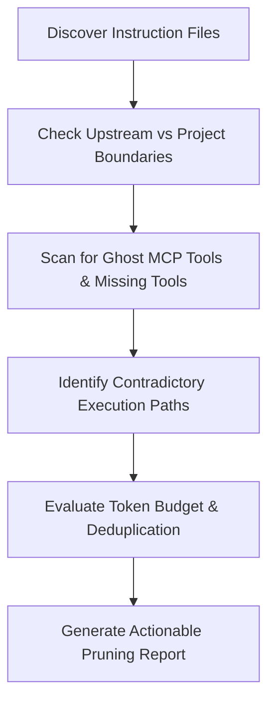

# Instructions Hygiene & Context Engineering Skill

This skill provides an automated audit framework to assess, prune, and maintain repository-level AI instruction files ([`.agents/AGENTS.md`](.agents/AGENTS.md), [`.github/copilot-instructions.md`](.github/copilot-instructions.md), [`CLAUDE.md`](CLAUDE.md), [`AGENTS.md`](AGENTS.md), and custom skills).

It enforces the principle that **context is a finite attention budget**; instruction files must contain the smallest set of high-signal facts that reliably change the coding outcome.

---

## 1. Trigger Conditions & Scope

Activate this skill when:
* The user asks to audit, review, clean, or assess instruction files or prompts.
* New upstream frameworks or tools are adopted, leaving old scaffolding behind.
* Agents repeatedly fail to follow local rules or flip between contradictory behaviors.
* Context size or token costs need optimization.

---

## 2. Core Audit Rubric (Keep / Remove / Move / Verify)

Evaluate every instruction against this 4-action matrix:

| Action | Decision Criteria | Examples in Apex |
| :--- | :--- | :--- |
| **KEEP** | Non-obvious local domain facts, authoritative validation commands, choices codebase cannot settle, hard operational constraints. | • Docker container execution (`workspace`, `playwright`)<br>• Team timezone scoping (`team.timezone`)<br>• Mandatory `$t()` string wrapping |
| **REMOVE** | Generic coding advice, exhaustive file trees, rules enforced automatically by linters/compilers, ghost tools, emotional coaxing, obsolete workarounds. | • *"Write clean, maintainable code"*<br>• Non-existent MCP tools (`search-docs`, `database-query`)<br>• *"Think step by step"* |
| **MOVE** | Valid guidance that belongs in path-specific files or linked domain architecture documentation rather than global prompts. | • Detailed clinical use cases $\rightarrow$ `docs/use_cases/`<br>• In-depth database schemas $\rightarrow$ `DATABASE_WORKFLOW.md`<br>• Deep i18n workflows $\rightarrow$ `docs/architecture/` |
| **VERIFY** | Commands, versions, ports, and SDK requirements that may have drifted from actual repository state. | • Node / PHP version numbers<br>• Docker compose service names and port mappings<br>• Test filter flags (`--compact`) |

---

## 3. The 5-Step Instruction Audit Procedure

When invoked, execute this sequential audit:



### Step 1: Discover & Map Instruction Files
Identify all active instruction files across the repository:
- **Project Canonical Rules**: `.agents/AGENTS.md` and `.github/copilot-instructions.md` (must be byte-for-byte synced).
- **Upstream Framework Scaffolding**: `AGENTS.md`, `CLAUDE.md`, and vendor skills (`.agents/skills/**`).
- **Domain Guides**: `ARCHITECTURE.md`, `TESTING.md`, `DEPLOYMENT.md`, `DATABASE_WORKFLOW.md`.

### Step 2: Upstream vs. Local Boundary Check
- Verify that upstream framework files (e.g. Laravel Boost scaffolding) remain distinct from custom project invariants.
- Ensure the **Precedence Notice** header is intact at the top of upstream files, directing agents to `.agents/AGENTS.md`.

### Step 3: Ghost Tool & Dead Reference Scan
- Inspect `<mcp_servers>` available in the current environment.
- Flag any instructions mandating tools that do not exist (e.g. requiring `search-docs` or `database-query` when only `codegraph` and `context-mode` are active).

### Step 4: Contradiction & Scope Analysis
Scan for contradictory directives across active files:
- **Host vs Container**: Does any file instruct running commands directly on host when Rule #1 requires Docker?
- **Testing Frameworks**: Does any file reference deprecated or unused test runners (e.g. Dusk in `tests/Browser/`) when the project standard is Playwright in `e2e/`?
- **Viewports & Breakpoints**: Are viewport lists consistent across `playwright.config.ts`, `TESTING.md`, and `.agents/AGENTS.md`?

### Step 5: Attention Budget & Signal-to-Noise Scoring
- Calculate rough line count and token weight of instruction files.
- Identify duplicate paragraphs repeated across multiple files.
- Replace verbose procedural coaching with concise definitions of done.

---

## 4. Standard Audit Output Report

When completing an audit, present the findings in this structured format:

```markdown
# Instructions Hygiene Audit Report

## 1. Executive Summary & Health Score
- **Total Instruction Lines**: X lines across Y files
- **Signal-to-Noise Assessment**: [High / Moderate / Low]
- **Synchronization Status**: [.agents/AGENTS.md <-> .github/copilot-instructions.md Sync: OK/FAIL]

## 2. Identified Anomalies & Contradictions
| File | Issue Type | Severity | Description & Impact |
| :--- | :--- | :--- | :--- |
| `path/to/file` | [Ghost Tool / Contradiction / Bloat] | [High/Med/Low] | Details of the issue |

## 3. Keep / Remove / Move / Verify Recommendations
- **Keep**: Key rules confirmed essential.
- **Remove**: Dead boilerplate, ghost tools, and obsolete workarounds.
- **Move**: Path-specific rules to relocate to domain documentation.
- **Verify**: Commands or versions requiring live environment testing.

## 4. Proposed Surgical Diffs
[Provide exact diffs or actions to apply]
```
