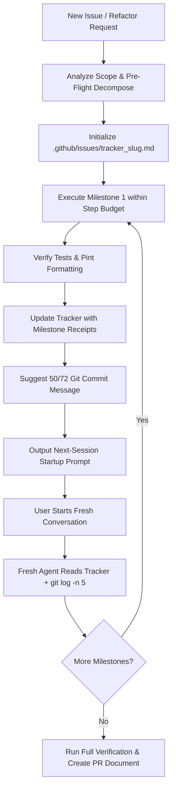

# Milestone Task Orchestrator

This skill provides a systematic protocol to decompose large issues into self-contained, verifiable, non-breaking milestones executed sequentially across **fresh conversation sessions**. It prevents context bloat (preserving quota) while maintaining 100% architectural continuity via a single-source-of-truth progress tracker.

---

## 1. Core Principles

1. **Pre-Flight Decomposition**:
   - Deconstruct the broad objective into $N$ discrete milestones.
   - **Milestone Sizing Invariants**:
     - **Non-Breaking**: Code compiles cleanly, existing and new tests pass, zero regressions.
     - **Atomic Commit**: Forms a natural standalone semantic git commit (`feat:`, `fix:`, `refactor:`).
     - **Bounded Step Budget**: Designed to complete in **30–50 steps** (strict maximum: **50–80 steps**).

2. **Persistent Tracker as Single Source of Truth**:
   - Maintain `.github/issues/tracker_<issue_slug>.md` throughout the lifecycle.
   - Stores architectural context, completed receipts, active milestone specs, discovered quirks, and technical debt.

3. **Deterministic Single-Milestone Handoff Protocol**:
   - Conclude each milestone with verification, commit suggestions, and a copy-pasteable startup prompt targeting **strictly the next single milestone ($X+1$)**.
   - **Mandatory Handoff Phrasing Invariant**: Never write open-ended prompts like *"Start with Milestone X"*. ALWAYS write explicit, bounded prompts using this exact template:
     ```text
     Please continue executing <Feature/Issue Name> from:
     .github/issues/tracker_<slug>.md

     Execute ONLY Milestone <X+1>: <Milestone Name>.
     Verify tests, update tracker receipts, propose 50/72 commit message, and output handoff prompt for Milestone <X+2>. Do NOT proceed to Milestone <X+2> in that turn.
     ```

4. **Zero-Loss Fresh Session Bootstrapping**:
   - On Turn 1 of any continuation session, inspect `.github/issues/tracker_<issue_slug>.md`, run `git log -n 5`, and verify `git status`.

5. **Continuous Tracker Synchronization on Issues & Feedback**:
   - Whenever bugs, visual defects, UI inconsistencies, or layout feedback are reported or discovered during milestone execution or review:
     - **Update Tracker First**: Immediately persist the issues into `.github/issues/tracker_<issue_slug>.md` under Section 4 (*Active Task Scope/Acceptance Criteria*), Section 5 (*Discovered Quirks, Blockers & Lessons Learned*), or Section 6 (*Technical Debt & Deferred Refactors*) before writing code.
     - **Zero-Loss Retention**: Ensure no discovered defect or user feedback is lost between turns or sessions.

6. **Strict Single-Milestone Session Boundary (No Cascading)**:
   - Each session or conversation MUST execute and verify **strictly ONE milestone** ($X$).
   - Even if the user prompt says *"Start with Milestone X"*, complete ONLY Milestone $X$.
   - **Mandatory Stop Point**: Upon completing Milestone $X$, the agent MUST:
     1. Run targeted verification tests.
     2. Update tracker receipts (`tracker_<slug>.md`).
     3. Suggest a strict 50/72 git commit message (see `git-commit-discipline` skill):
        - **Line 1 (Subject)**: Strictly $\le 50$ characters total (inclusive of `type(scope): `). Calculate `subject.length` before emitting.
        - **Line 2**: Blank.
        - **Line 3+ (Body)**: Wrapped strictly $\le 72$ characters per line.
     4. Output the standardized single-milestone startup prompt for Milestone $X+1$.
     5. **STOP execution**. Never proceed into Milestone $X+1$ in the same conversation without explicit user instruction.

---

## 2. Issue, Blocker & Technical Debt Lifecycle

Every discovered defect, user feedback item, and architectural debt item must follow a strict resolution path:

| Category | Definition | Resolution Timing | Action in Tracker |
|---|---|---|---|
| **Active Milestone Regression / Defect** | Visual clipping, layout overflow, broken button, or styling mismatch in active scope. | **Immediate (Same Session)** | Add to Section 4 (*Acceptance Criteria*). Must pass before milestone completion. |
| **Cross-Cutting / Shared Refactor** | Refactoring shared components across multiple views (e.g. `LiveClockBadge.vue` in Dashboard & Calendar). | **Sub-Milestone Insertion** | Insert as `Milestone X.1` or expand Section 1 Roadmap. |
| **Discovered Quirk / Framework Edge-Case** | Upstream behavior, CSS containment quirk, or browser oddity. | **Documented & Guarded** | Log in Section 5 (*Discovered Quirks*) with defensive test assertion. |
| **Deferred Technical Debt** | Non-critical cleanup, secondary documentation, or legacy deprecation. | **Final Hardening Milestone (Milestone $N$)** | Log in Section 6 (*Technical Debt*). **MUST be resolved in Milestone $N$ before PR creation**. |

### Zero Open Debt Invariant
A feature issue is **NEVER complete** and a PR description file **MUST NEVER be created** while unresolved items remain in Section 5 (*Blockers*) or Section 6 (*Technical Debt*). All items must be verified resolved in Milestone $N$.

---

## 3. Session Lifecycle Workflow



---

## 4. Tracker File Specification Template

When starting a new issue, initialize `.github/issues/tracker_<issue_slug>.md` using this exact structure:

```markdown
# Issue Tracker: <Issue Title>

> **Status**: In Progress  
> **Tracker File**: `.github/issues/tracker_<slug>.md`  
> **Active Milestone**: Milestone <X> of <Total>  
> **Last Updated**: <Timestamp>

---

## 1. Feature Roadmap & Milestones

- [x] **Milestone 1: <Name>** — *Completed* (`<commit-hash>`)
- [ ] **Milestone 2: <Name>** — ⏳ *Current Focus (Session 2)*
- [ ] **Milestone 3: <Name>** — *Pending (Session 3)*
- [ ] **Milestone 4: <Name>** — *Pending (Session 4)*

---

## 2. Architectural Decisions & Key Context
- **Data Models / Schema**: <Key decisions, columns, enums>
- **Service Boundaries**: <Services responsible for logic>
- **Frontend Components**: <Key Vue components and props>

---

## 3. Completed Milestone Receipts

### Milestone 1: <Name>
- **Commit**: `<commit-hash>` — `<commit-subject>`
- **Files Modified/Added**: `<list of files>`
- **Verification Receipts**:
  - Pest: `<test_file>` (X passed)
  - Vitest: `<test_file>` (X passed)
- **Decisions Made**: <Specific architectural decisions>

---

## 4. Active Task: Milestone <X> (<Name>)

- **Objective**: <Clear 1-sentence goal>
- **Step Budget**: ~30-50 steps (Max 80)
- **Files to Modify/Create**:
  - `<file_path_1>`: <What to do>
  - `<file_path_2>`: <What to do>
- **Acceptance Criteria**:
  1. <Criterion 1>
  2. <Criterion 2>
- **Verification Commands**:
  - `docker compose exec -T workspace php artisan test <path> --compact`
  - `docker compose exec -T workspace npm run test:unit <path>`

---

## 5. Discovered Quirks, Blockers & Lessons Learned
- <Edge cases, framework quirks, or lessons learned in previous sessions>

---

## 6. Technical Debt & Deferred Refactors
- <Items noted for follow-up before closing the master issue/PR>
```

---

## 5. End-of-Session Handoff Prompt Template

At the end of each milestone session, output this exact handoff block:

```markdown
### 🚀 Ready for Next Fresh Session

Start a new conversation and paste:

> Continue working on **[Issue Title]**, picking up **Milestone <X+1>: <Milestone Name>** from [.github/issues/tracker_<slug>.md](.github/issues/tracker_<slug>.md).
> Check `git log -n 5` to see previous milestone commits and verify clean baseline before starting.
```
