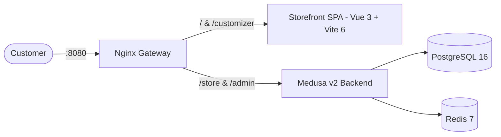

# Meltia — Instantes Eternos

> E-Commerce platform for custom-manufactured chibi-style 3D collectible figures in personalized folding blind boxes, companion trading cards, and AI-assisted gifting narratives.

---

## 📖 Canonical Documentation Index

All core architectural decisions, specifications, workflows, and operations are version-controlled in the [`docs/`](./docs) directory:

| Document | Description |
|---|---|
| **[System Architecture](docs/ARCHITECTURE.md)** | Full system topology, Medusa v2 headless backend, Vue 3 + Vite 6 SPA, Nginx gateway, $6/mo VPS resource budgets. |
| **[Product Requirements](docs/REQUIREMENTS.md)** | WhatsApp order requirements (Diana Mora), physical deliverables, 8-step customizer builder, workshop Hub. |
| **[Database & Schema](docs/DATABASE.md)** | PostgreSQL 16 schema, entity relationships (`BoxTheme`, `BodyCatalog`, `CustomOrderSpec`, `CustomFigure`), migrations. |
| **[Testing & Verification](docs/TESTING.md)** | Tiered testing pyramid: Jest unit isolation, module integration, and Playwright multi-viewport visual checks. |
| **[Production Deployment](docs/DEPLOYMENT.md)** | Docker Compose production stack, static bundle compilation, Nginx proxy, SSL, and environment secrets. |
| **[Debugging & Troubleshooting](docs/DEBUGGING.md)** | Diagnostics cheat sheet, Vite host permissions, Nginx route boundaries, Playwright execution, common pitfalls. |
| **[Active Milestone Tracker](.github/issues/tracker_meltia_blindbox.md)** | Live phased milestones, completed receipts, acceptance criteria, and lessons learned. |

---

## 🚀 Quick Start (Development)

Meltia runs in a pure containerized Docker environment with **Zero Host Execution**.

### 1. Start Services

```bash
docker compose up -d
```

### 2. Verify System Readiness

```bash
./scripts/check-agent-readiness.sh
```

### 3. Application Access Points

- **Application Gateway (Nginx)**: [http://localhost:8080/](http://localhost:8080/)
- **Storefront Customizer**: [http://localhost:8080/customizer](http://localhost:8080/customizer)
- **Medusa Admin Dashboard**: [http://localhost:8080/app](http://localhost:8080/app)
- **Medusa Store API**: [http://localhost:8080/store](http://localhost:8080/store)

---

## 🧪 Verification Commands

All development and test commands execute inside Docker using the `-T` flag:

```bash
# Backend unit tests (Jest)
docker compose exec -T workspace npm run test:unit

# Storefront typecheck & production build
docker compose exec -T workspace bash -c "cd /app/apps/storefront && npm run build"

# Playwright multi-viewport visual verification
docker compose exec -T playwright bash -c "NODE_PATH=/home/ubuntu/.npm/_npx/e41f203b7505f1fb/node_modules node scripts/capture-visuals.cjs"
```

---

## 🛠️ Architecture Summary



- **Headless Backend**: Medusa v2 with isolated `blindbox` module, PostgreSQL migrations, MikroORM DML, transactional workflows.
- **Client Storefront**: Vue 3.5 + Vite 6 + Pinia + Tailwind CSS + `@medusajs/js-sdk` (566ms dev boot, static zero-overhead production bundle).
- **Manufacturing Engine**: Server-side 300 DPI flat packaging dieline compositor (PDF/SVG), filament bill of materials (BOM), and face image packs.
