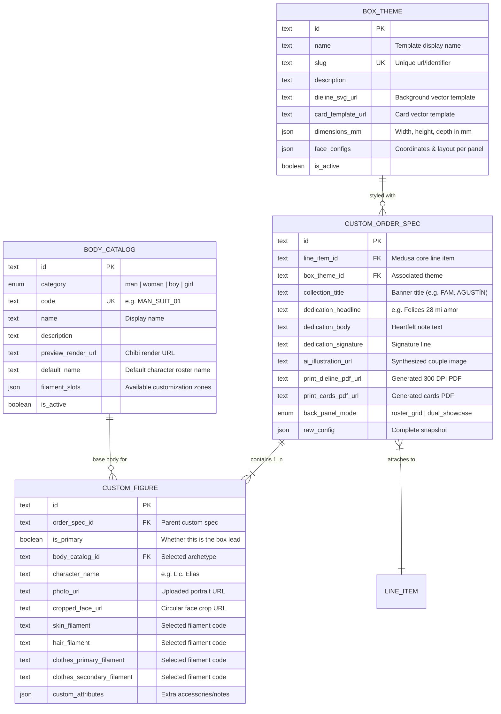

# Meltia: Database & Schema Documentation

## 1. Database Architecture

Meltia uses **PostgreSQL 16** managed via Medusa v2's DML (Data Modeling Language) and MikroORM.
All custom data structures reside within the `blindbox` module, maintaining strict isolation from core commerce models.



---

## 2. Table Definitions & Constraints

### 2.1. `box_theme`
- **Primary Key**: `id` (`text`)
- **Unique Indexes**: `box_theme_slug_unique` on `slug`
- **JSON Metadata**:
  - `dimensions_mm`: `{ width: 80, height: 120, depth: 60 }`
  - `face_configs`: Coordinates and bounding boxes for front banner, side dedication frame, AI scene placement, and back roster slots.

### 2.2. `body_catalog`
- **Primary Key**: `id` (`text`)
- **Unique Indexes**: `body_catalog_code_unique` on `code`
- **Categories**: Indexed enum `category` (`man`, `woman`, `boy`, `girl`) for high-performance storefront tab filtering.

### 2.3. `custom_order_spec`
- **Primary Key**: `id` (`text`)
- **Foreign Keys**:
  - `box_theme_id` -> `box_theme(id)` on delete set null.
  - `line_item_id` -> `line_item(id)` on delete cascade.

### 2.4. `custom_figure`
- **Primary Key**: `id` (`text`)
- **Foreign Keys**:
  - `order_spec_id` -> `custom_order_spec(id)` on delete cascade.
  - `body_catalog_id` -> `body_catalog(id)` on delete set null.

---

## 3. Migration Lifecycle & Invariants

> [!CRITICAL]
> **Zero Host Execution Invariant**: Never run `npx medusa` or PostgreSQL tools directly on the host machine. All migrations and queries must run in the Docker container.

### Generating a Migration
When modifying model files in `apps/backend/src/modules/blindbox/models/`:
```bash
docker compose exec -T workspace bash -c "cd /app/apps/backend && npx medusa db:generate blindbox"
```

### Applying Migrations
```bash
docker compose exec -T workspace bash -c "cd /app/apps/backend && npx medusa db:migrate"
```

### Direct PostgreSQL Schema Inspection
```bash
docker compose exec -T db psql -U postgres -d meltia -c "\dt"
```

---

## 4. Seeding Initial Catalog

Catalog data is seeded via [`apps/backend/src/migration-scripts/seed-blindbox-catalog.ts`](file:///home/nachopitt/projects/meltia/apps/backend/src/migration-scripts/seed-blindbox-catalog.ts):
- **8 Box Themes**: `celestial-night-gold`, `pastel-dream-clouds`, `vintage-rose-garden`, `cyber-neon-arcade`, `terracotta-sunset`, `enchanted-forest-emerald`, `monochrome-noir-minimal`, `festive-confetti-party`.
- **16 Base Bodies**: 4 Men (`MAN_SUIT_01`, `MAN_CASUAL_01`, `MAN_SPORTS_01`, `MAN_MARTIAL_01`), 4 Women (`WOMAN_GOWN_01`, `WOMAN_CASUAL_01`, `WOMAN_OFFICE_01`, `WOMAN_ATHLETIC_01`), 4 Boys, 4 Girls.

To run seed:
```bash
docker compose exec -T workspace bash -c "cd /app/apps/backend && npx medusa exec ./src/migration-scripts/seed-blindbox-catalog.ts"
```
