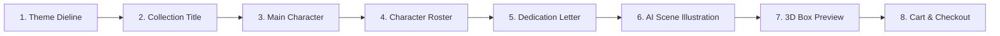

# Meltia: Product Requirements & Specification

## 1. Product Genesis & Concept

Extracted from real customer orders and operational specifications (Diana Mora / WhatsApp production assets `IMG-20260908-WA0012.jpg` and `IMG-20260908-WA0013.jpg`), Meltia specializes in **Personalized 3D Collectible Blind Boxes**.

### Core Deliverables per Order
1. **1+ 3D-Printed Chibi Figures**:
   - Fixed bodies chosen from a pre-modeled catalog (suits, sportswear, dresses, martial arts gi, casual).
   - Custom head modeled/printed from a customer-uploaded portrait photo.
   - Specific FDM filament colors mapped to skin, hair, and clothing.
2. **Personalized 6-Panel Folding Blind Box**:
   - High-gloss CMYK printed tuck-box with cut/crease guides and glue flaps.
   - Panels customized with collection title, dedication letter, AI-generated couple/family illustration, and back-panel character roster.
3. **Double-Sided Collectible Trading Cards (`Tarjetas Coleccionables`)**:
   - 2-up trading cards matching the box theme, containing mini character art and dedication parchment.

---

## 2. Customer Customization Flow (8 Steps)

The storefront customizer guides users through an 8-step builder:

1. **Step 1 — Theme Selection**: Choose 1 of 8 visual box templates (e.g., *Celestial Night Gold*, *Pastel Dream Clouds*, *Vintage Rose Garden*, *Cyber Neon Arcade*).
2. **Step 2 — Collection Ribbon Title**: Enter family or recipient name (e.g. `FAM. AGUSTÍN` or `ELIAS`) rendered live inside the vintage banner.
3. **Step 3 — Main Character Builder**:
   - Body selection from 16 catalog archetypes (Men, Women, Boys, Girls).
   - Face photo upload with circular crop.
   - Filament color pickers: Skin, Hair, Clothing.
4. **Step 4 — Back-Panel Configuration (Roster vs Showcase)**:
   - *Mode A (Series Roster)*: 4–6 mini figures with individual names (`Lupe Shot`, `Lic. Elias`, mystery silhouettes).
   - *Mode B (Dual Showcase)*: Full-height portrait of partner or second main character.
5. **Step 5 — Dedication Lettering**:
   - Headline (e.g. `Felices 28 mi amor`) + emotional body message + signature.
6. **Step 6 — AI Scene Synthesis**:
   - Gemini/Imagen prompt generation for the couple/family hugging illustration on the box side panel and trading cards.
7. **Step 7 — Interactive 3D Packaging Preview**:
   - 360° rotation preview displaying front, back, lateral dedication, lateral AI art, and top tuck flap.
8. **Step 8 — Cart & Checkout**:
   - Attaches configuration payload to Medusa cart line item and proceeds to shipping calculation.

---

## 3. Back-Office Operations Hub (Diana's Workshop)

The Medusa Admin dashboard provides tools to fulfill custom manufacturing orders without manual Photoshop compositing:

1. **3D Printing Spec Sheet (Filament BOM)**:
   - Aggregated bill of materials listing exact filament weights, spool codes, and body STL references.
2. **Face Assets ZIP Archive**:
   - Pack containing high-resolution raw customer photos alongside cropped circular facial previews for 3D modelers.
3. **300 DPI Flat Dieline PDF Generator**:
   - Server-side vector compositor rendering the exact 6-panel net (dimensions, cut lines, folding creases, glue tabs) ready for commercial printing.
4. **Companion Trading Cards Sheet**:
   - 2-up sheet ready for cardstock trimming.

---

## 4. Feature Roadmap & Milestones

- [x] **Milestone 1: Backend Domain Models & Catalog Seed**
  - Medusa v2 `blindbox` module, PostgreSQL migration, catalog seed (8 themes, 16 bodies), Jest unit tests.
- [ ] **Milestone 2: Dieline PDF & Asset Generator Engine**
  - Headless 300 DPI flat folding box dieline compositor and trading cards sheet generator.
- [ ] **Milestone 3: AI Scene Synthesis & Dedication Engine**
  - Posed hugging illustration generation via Gemini/Imagen and contextual dedication copywriting.
- [ ] **Milestone 4: Storefront Customizer Wizard**
  - Full Vue 3 wizard implementation with photo cropper, filament selector, and cart integration.
- [ ] **Milestone 5: Admin Production Dashboard & Verification Sweep**
  - Medusa Admin manufacturing hub for 1-click BOM and print asset exports.
